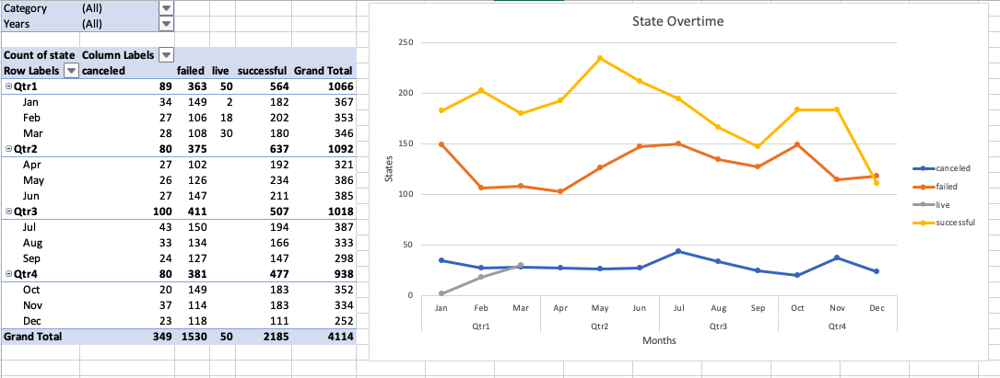

# Excel Kickstart Project

## Background

Over $2 billion has been raised using the massively successful crowdfunding service, Kickstarter, but not every project has found success. Of the more than 300,000 projects launched on Kickstarter, only a third have made it through the funding process with a positive outcome.

Getting funded on Kickstarter requires meeting or exceeding the project's initial goal, so many organizations spend months looking through past projects in an attempt to discover some trick for finding success. In this project, I will organize and analyze a database of 4,000 past projects in order to uncover any hidden trends.

## Project Description

Using the Excel table provided, I will modify and analyze the data of 4,000 past Kickstarter projects to uncover market trends in the following areas.

  * 

  * Color code the state of associated campaigns
     - use conditional formatting to fill each cell with a different color, depending on whether the associated campaign was successful, failed, or canceled, or is currently live.
  
  * Calculate and Color code `Percent Funded`
     - Use a formula to uncover how mucn money a campaign made to reach its initial goal
     - Use conditional formatting to fill each cell in the `Percent Funded` column using a three-color scale.

  * 

  * Split the `Category and Sub-Category` column to display `Category` and `Sub-Category` separately. 
     - Use formulas to split the `Category and Sub-Category` column into two parts.

Using the above analysis, I will use pivot table and pivot chart to visualize market trends.

* Campaign State per **category** and **sub-category**
  
   
  
  * Use a pivot table to analyze the initial worksheet to count how many campaigns were successful, failed, canceled, or are currently live per **category**.

  * Create a stacked column pivot chart that can be filtered by country based on the table you have created.

* Outcomes Based on Launch Date 
  
  
  
  * Use use Unix timestamps to convert the dates stored within the `deadline` and `launched_at` columns
  * Visualize the outcomes based on launch date by creating a pivot table and a pivot chart line graph
  
  
## Project Summary

1. Given the provided data, what are three conclusions we can draw about Kickstarter campaigns?

   * Conclusion #1 – Case Successful Percentage Among Different Categories
     •	The Theater Category has the most cases (total number: 1393) and the successful rate is the 2nd highest among all categories (Successful Rate: 60%)
     •	The Music Category has the highest successful rate (77%).

   * Conclusion #2 – The Number of Cases Across Different Countries
     •	USA has the most amount of cases. 
     •	The number of cases in the USA is more than the number of cases from all other countries combined. 
       
   * Conclusion # 3 – Timing
     •	In the 3rd quarter (around August and September), the number of most states (successful, cancelled and failed) all dropped. In the beginning of the 4th quarter (October and early November), the number of different states (successful, cancelled and failed) started to rise again.
     •	The application starts from January. 
     •	Not including live cases, there are more successful cases than cancelled or failed cases.

2. What are some limitations of this dataset?

   * This dataset doesn’t provide the source, so we can’t guarantee the quality and the accuracy of this dataset.
   * This dataset may include outliers which would affect the accuracy of the analysis.
   * There may be other values that need to be included in this dataset to make accurate analysis. 

3. What are some other possible tables and/or graphs that I could create?

   * The relation between the number of words in the blurb and the state
   * The relation between deadline and state - How many non-successful (failed, cancelled and not live) cases missed the deadline?
   * The relation between the number of staff and the state
   * Category vs. donation – Which category has the most amount of donation and which one has the least?

